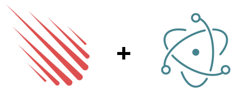

# Meteor Desktop
###### aka Meteor Electron Desktop Client
> Build desktop apps with Meteor & Electron. Full integration with hot code push implementation.

## What is this?

This is a complete implementation of integration between `Meteor` and `Electron` aiming to achieve the same level of developer experience like `Meteor` gives. 
To make it clear from the start, this is a **desktop client** - it is just like your mobile clients with `Cordova` - but for desktops with `Electron`. It also features a full hot code push implementation - which means you can release updates the same way you are used to.  

## Prerequisites

 - Meteor >= `1.3.4`<sup>__*1__</sup>
 - at least basic [Electron](http://electron.atom.io/) framework knowledge
 - mobile platform added to project<sup>__*2__</sup>  

<sup>__*1__ `1.3.3` is supported if you will install `meteor-desktop` with `npm >= 3`</sup>

<sup>__*2__ you can always build with `--server-only` so you do not actually have to have android sdk or xcode to go on with your project</sup>

### Quick start
```bash
 cd /your/meteor/app
 meteor npm install --save-dev meteor-desktop
 # you need to have any mobile platform added (ios/android)
 meteor --mobile-server=127.0.0.1:3000
 
 # open new terminal

 npm run desktop -- init
 npm run desktop

 # or in one command `npm run desktop -- --init` 
```

# Documentation

## Architecture

If you have ever been using any `Cordova` plugins before you will find this approach alike. In `Cordova` every plugin exposes its native code through a JS api available in some global namespace like `cordova.plugins`. The approach used here is similar.

In `Electron` app, there are two processes running along in your app. The so-called `main process` and `renderer process`. Main process is just a JS code executed in `node`, and the renderer is a `Chromium` process. In this integration your `Meteor` app is run in a the `renderer` process and your desktop specific code runs in the `main` process. They are communicating through IPC events. Basically the desktop side publishes its API as an IPC event listeners. In your `Meteor` code, calling it is a simple as `Desktop.send('module', 'event');`.  

Code on the desktop side is preferred to be modular - that is just for simplifying testing and encapsulating functionalities into independent modules. However you do not have to follow this style, there is an `import` dir in which you can structure your code however you want. The basics of an `Electron` app are already in place (reffered as `Skeleton App`) and your code is loaded like a plugin to it.

Below is a high level architecture diagram of this integration.


## Scaffolding your desktop app

If you have not run the example from the Quick start paragraph, first you need to scaffold a `.desktop` dir in which your `Electron`'s main process code lives.
To do that run: (assuming `npm install --save-dev meteor-desktop` did add a `desktop` entry in the `package.json scripts` section)
```bash
npm run desktop -- init
```
This will generate an exemplary `.desktop` dir. Lets take a look what we can find there:
```
    assets              <dir> # place all your assets here
    import              <dir> # all code you do not want to structure into modules  
    modules             <dir> # your desktop modules (check modules section for explanation)
      example           <dir> # module example
        index.js              # entrypoint of the example module
        example.test.js       # functional test for the example module
        module.json           # module configuration  
    desktop.js                # your Electron main process entry point - treated like a module
    desktop.test.js           # functional test for you desktop app
    settings.json             # your app settings
    squirrelEvents.js         # handling of squirrel.windows events
```

Tak a look into the files. Most of them have meaningful comments inside.

### settings.json

field|default|description
-----|-------|-----------
`name`|My Meteor App|just a name for your project
`version`||version of the desktop app
`projectName`|MyMeteorApp|this will be used as a `name` in the generated app's package.json
`devTools`|true|whether to install and open `devTools`, set automatically to false when building with `--production`
`devtron`|true|check whether to install `devtron`, set automatically to false when building with `--production`, (more)[https://github.com/wojtkowiak/meteor-desktop/tree/master#devtron]
`desktopHCP`|true|whether to use `.desktop` hot code push module - (more)[https://github.com/wojtkowiak/meteor-desktop/tree/master#desktophcp---desktop-hot-code-push-module]
`desktopHCPIgnoreCompatibilityVersion`|false|ignore the `.desktop` compatibility version and install new versions even if they can be incompatible
`autoUpdateFeedUrl`|http://127.0.0.1/update/:platform/:version|url passed to [`autoUpdater.setFeedUrl`](https://github.com/electron/electron/blob/master/docs/api/auto-updater.md#autoupdatersetfeedurlurl-requestheaders), params are automatically set
`autoUpdateFeedHeaders`|{}}|http headers passed to [`autoUpdater.setFeedUrl`](https://github.com/electron/electron/blob/master/docs/api/auto-updater.md#autoupdatersetfeedurlurl-requestheaders)
`autoUpdateCheckOnStart`|true|whether to check for updates on app start
`rebuildNativeNodeModules`|false|turn on or off recompiling native modules -> (more)[https://github.com/wojtkowiak/meteor-desktop/tree/master#native-modules-support]
`webAppStartupTimeout`|60000|amount of time after which the downloaded version is considered faulty if Meteor app did not start - (more)[https://github.com/wojtkowiak/meteor-desktop/tree/master#hot-code-push-support]
`window`||Production options for the main window - see (here)[https://github.com/electron/electron/blob/master/docs/api/browser-window.md#new-browserwindowoptions]
`windowDev`||Development options for the main window, applied on to of production options
`uglify`|true|whether to process the production build with uglify
`plugins`||npm packages that are meteor-desktop plugins
`dependencies`|{}|the same like in `package.json`
`packageJsonFields`||fields to add to the generated `package.json` in your desktop app
`builderOptions`||
`packagerOptions`||

### Hot code push support
https://guide.meteor.com/mobile.html#recovering-from-faulty-versions

### How to write plugins

Plugin is basically a module exported to a npm package.


### Native modules support

This integration fully supports rebuilding native modules (npm packages with native node modules) against `Electron`'s `node` version. However to speed up the build time, it is **switched off by default**. 

If you have any of those in your dependencies, or you know that one of the packages or plugins is using it, you should turn it on by setting `rebuildNativeNodeModules` to true in your `settings.json`. Currently there is no mechanism present that detects whether the rebuild should be run so it is fired on every build. A cleverer approach is planned before `1.0`. 

### Devtron

(`Devtron`)[http://electron.atom.io/devtron/] is installed and activated by default. It is automatically removed when building with `--production`.

#### desktopHCP - `.desktop` hot code push module
